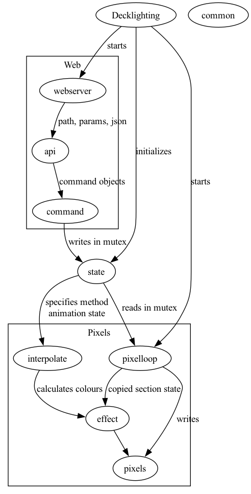

# README

## Files

### Decklighting

`main()` Entry point. 
* Starts the pixel loop and web server threads
* Listens for termination.

### common

* Holds enumeraton name/value mappings.
* Describes our pixels - lengths, sections

### state
* describes the state of the pixels
* holds the shared state
* provides a mutex

### pixelloop
* reads the shared state in the mutex
* notes that the shared state has been read (resets `touched`, etc)
* draws the animation
* a `yeild()` between each frame
* uses [effect *](#effect) to do the drawing

### effect
* different effects
* global functions sensibly named

### interpolate
* deals with colour comuutation

### webserver
* http server
* handles static content
* converts `/api` requests to `nholman:json`, passes to [api](#api)
* slow to compile, so does the minimum to make the code less volatile

### api
* interprets the url path, parameters, and json content
* constrincts command objects
* passes the command objects to `handleCommand` methods

### command 
* acquires a mutex on the shared state and updates it
* `touched` and `needsRepaint` signals to [the pixel loop](#pixelloop) that an update is needed
 